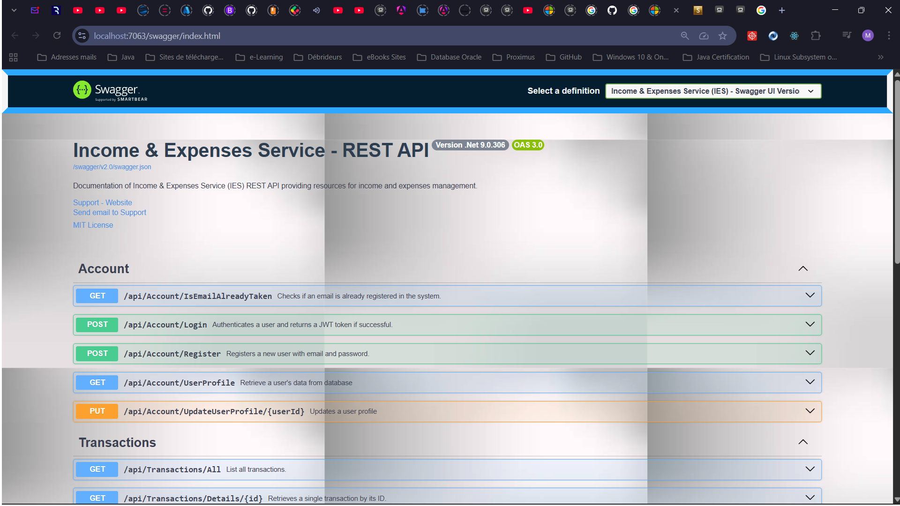
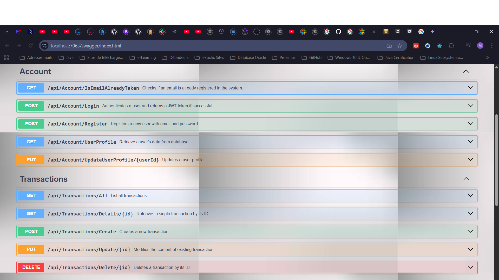
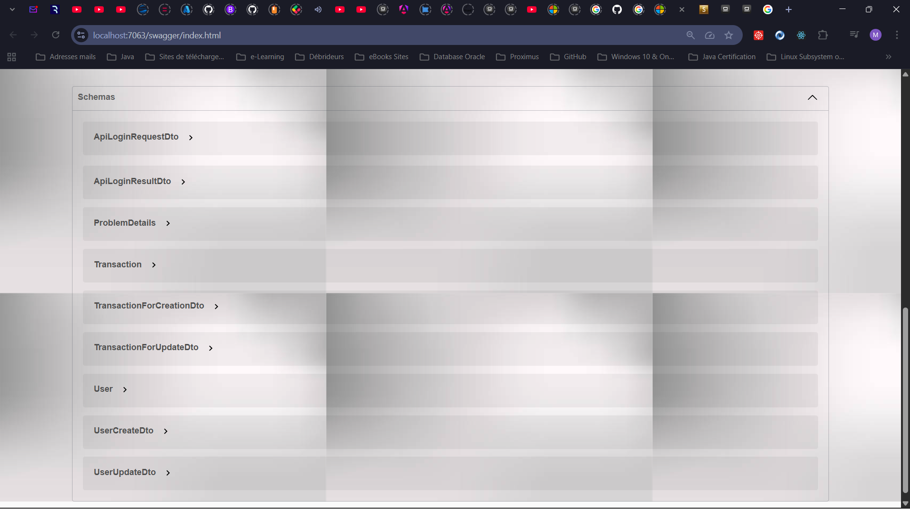
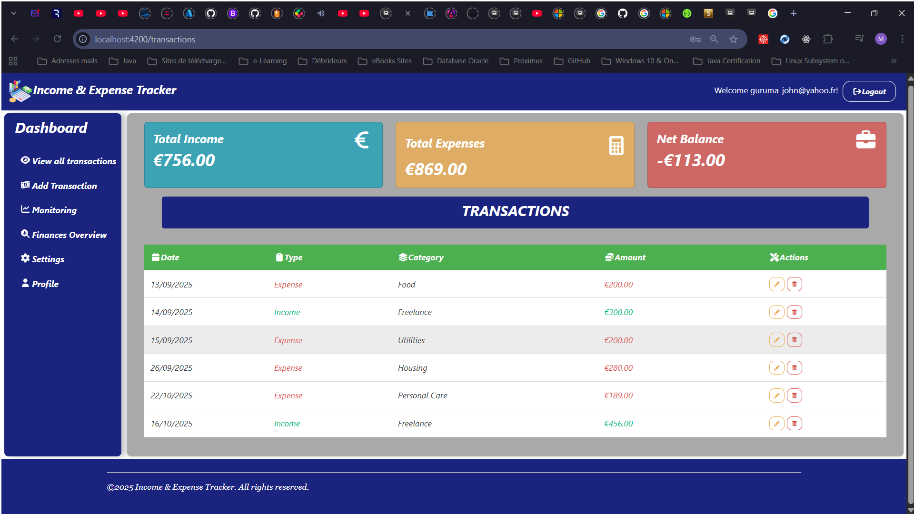

# Income & Expense Tracker

### An overview of the ASP.NET Core Web API back-end: 

### An overview of the Angular Front-end:

## 1. Overview

**Income & Expense Tracker** is a project which goal is to practically build a full stack application using ASP.NET Core API and Angular. 
The application allows users to manage their expenses efficiently by providing features such as user authentication, expense tracking, and data visualization.

Two separate projects are used for clear separation of concerns and easier deployment: 
- the backend API built with ASP.NET Core 10
- and the frontend application developed using Angular.

The ASP.NET Core API houses the backend logic, including controllers,services, and data cases using EF Core to interact with a SQL Server database.
However, the Angular frontend handles the user interface and interacts with the backend API to perform various operations using HTTP requests.

## 2. Objectives

- Create and secure **RESTful API** endpoints using good practices
- Perform essential **CRUD** operations
- Integrate thoses endpoints with an **Angular** frontend including authentication using **JSON Web Tokens**
- Implement **error handling** and **validation**
- Write **unit and integration tests** to ensure code quality
- Containerize the application using **Docker** for easy deployment
- Deploy application to a production environment to make it ready for real-world use

## 3. System Design

Software development is a complex process that requires much more than writing code; it requires a careful planning and 
design to ensure that the final product meets the requirements and is maintainable, scalable, and efficient.

To design our system, we follow **The Standard**, a structured approach for desigining software that promotes 
**modularity, separation of concerns, and testability**. 

(*)Our system is designed with a clear separation of concerns between the backend and frontend. 
The backend API is responsible for handling business logic, data access, and authentication, while the frontend focuses 
on providing a user-friendly interface for interacting with the API.

### 3.1. Functional Requirements
### 3.2. Non-Functional Requirements
### 3.3. Architecture

**The Standard** we adopted previously is considered as a software development philosophy that focuses on **clear boundaries, 
structured code, and predictable behavior**. It is based on well-established principles such as **SOLID**, **separation 
of concerns**, and **the Onion architecture** while emphasizing pragmatic, real-world application. 

At its core, **The Standard** introduces a structured way to design software using three primary layers, which includes:
1. **Brokers**: The data access layer, responsible for interacting with external systems such as databases, file systems, 
   and APIs. Brokers are the only place where EF Core interacts with the database, encapsulating CRUD operations, and 
   preventing EF Core code from leaking into business logic.
2. **Services**: The business logic layer, which processes data, applies rules, and maintains consistency. Services 
   handle all business logic, validation, and transformations before interacting with brokers or exposing functionality 
   to the API layer.
3. **Exposers**: The entry points, which expose application functionality to the outside world 
   through REST APIs, gRPC endpoints, Blazor components, or background workers. They acts as the communication boundary 
   between the appication and its clients, ensuring that all interactions follow clearly defined contracts.

## 4. Features

- **ASP.NET Core API** with **REST**ful endpoints
- **User registration** and **authentication**
- **Expense management** (add, view, update, delete expenses)
- **Responsive UI** design with **Angular**
- **Error handling** and **validation**
- **Unit and integration tests**
- Deployment scripts and instructions

## 5. Technologies

- **ASP.NET Core 10**
- **Angular 21**
- **Entity Framework Core 10**
- **SQL Server 2019**
- **JWT for authentication**
- **Docker for containerization**
- ...
